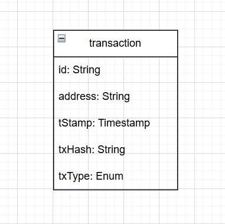

# Database

## Schema image

## Overview

The backend database is currently built around a single business entity: `Transaction`.

The schema shows a `transaction` table used to store the history of blockchain actions linked to a wallet address in the NFT marketplace. This model is also confirmed by the Prisma file `src/prisma/schema.prisma`.

## Table `Transaction`

Fields identified from the image and the Prisma schema:

| Champ | Type | Description |
| --- | --- | --- |
| `id` | `String` | Unique transaction identifier. In Prisma, it is generated automatically with `uuid()`. |
| `address` | `String` | Wallet address of the user who performed the operation. |
| `tStamp` | `Timestamp` / `DateTime` | Creation timestamp of the record. In Prisma, the default value is `now()`. |
| `txHash` | `String` | On-chain transaction hash. It links the record to the blockchain transaction. |
| `txType` | Enum | Type of marketplace action being recorded. |

## Possible `txType` values

The image shows the following values:

- `MINT`
- `SELL`
- `BUY`
- `UPDATE`
- `CANCEL`

In Prisma, these values are defined by the `TransactionType` enum. They represent the main actions in an NFT's lifecycle inside the marketplace:

- `MINT`: NFT creation
- `SELL`: listing or putting an NFT up for sale
- `BUY`: purchase action
- `UPDATE`: update to marketplace data or sale state
- `CANCEL`: cancellation of a sale or related operation

## Schema analysis

From the image, the design appears intentionally minimal:

- only one table is represented, which suggests a simple structure focused on transaction logging
- no relationships to other tables appear in the diagram
- the schema is designed more like an event history than a full NFT catalog model

This means that, in its current state, the database does not directly store:

- NFT details
- collections
- users as a relational table
- separate orders or listings

Instead, the backend mainly keeps a record of important blockchain actions, linked to a wallet address and a transaction hash.

## Implicit constraints

According to `schema.prisma`:

- `id` is the primary key
- all fields are required
- `tStamp` is populated automatically
- `txType` is restricted to a fixed set of values through an enum

## Technical source

The model is defined in:

- `src/prisma/schema.prisma`

The backend uses Prisma with a MySQL / MariaDB-compatible datasource.
